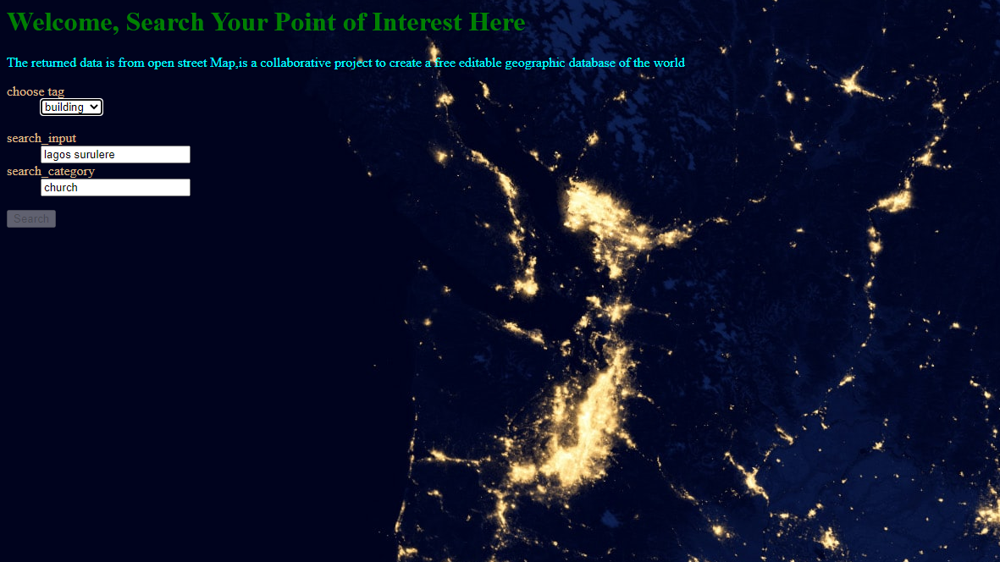

# Geolocation and Location Search Api


To get tags for this project [click here](https://wiki.openstreetmap.org/wiki/Map_features)


This project is designed to search POI(Point of Interests) in a specific location making use of Open street Map Wrapper OSMNX .

## Installing / Getting started

A quick introduction of the minimal setup you need to get project up and running .

```shell
git clone https://github.com/ChibuezeOnejeme/geolocation_category_search.git

cd geolocation_category_search

code .   < This will open an editor from shell/bash  >


venv/Scripts/activate //In CMD < activate venv for  windows>
env/Scripts/Activate.ps1 //In Powershel<activate venv for windows>

source venv/bin/activate< activate venv for Mac>

pip install -r requirements.txt

**requirements .txt**: This contains all dependency programs to be installed for the full functionality of project.
```
